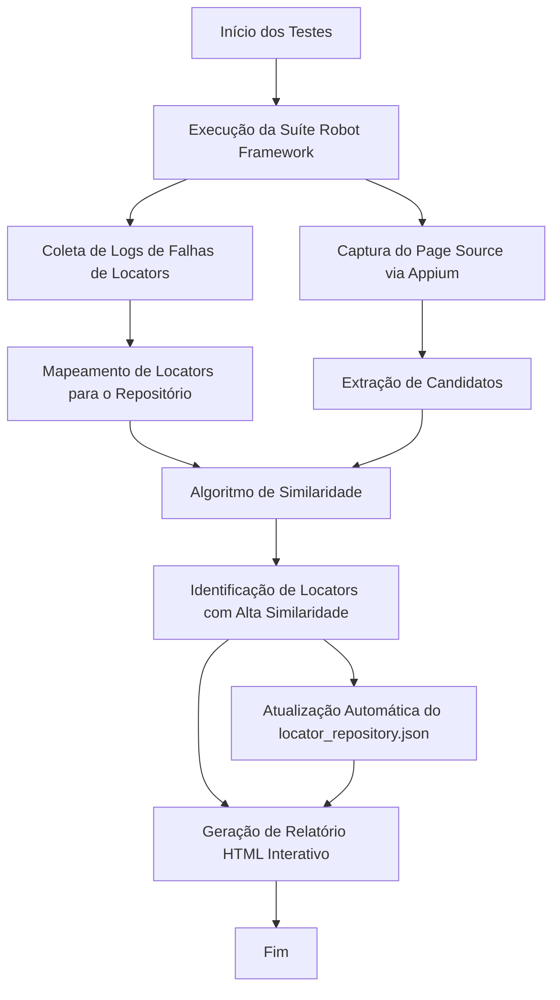
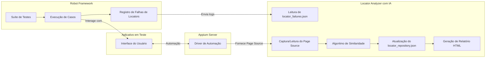

# Automação Mobile com Appium, Robot Framework e Python

## 🚀 Visão Geral do Projeto

Este projeto demonstra a automação de testes para aplicativos mobile Android utilizando **Appium**, **Robot Framework** e **Python**. O foco é a criação de testes robustos e de fácil manutenção para funcionalidades de login, incluindo a interação com teclados virtuais e tratamento de diferentes estados da tela.

## 🛠️ Tecnologias Utilizadas

*   **Appium**: Framework de automação de código aberto para aplicativos nativos, híbridos e web mobile.
*   **Robot Framework**: Framework de automação de testes genérico baseado em palavras-chave.
*   **Python**: Linguagem de programação utilizada para scripts de suporte e bibliotecas personalizadas.
*   **AppiumLibrary**: Biblioteca do Robot Framework para integração com Appium.
*   **UiAutomator2**: Driver do Appium para automação de testes Android.

## 📂 Estrutura do Projeto

```
e:\aut-mobile-ai-diagnostics\
├───.gitignore
├───.gitingnore
├───.pylintrc
├───README.md
├───requirements.txt
├───run_test.bat
├───.git\...
├───.venv\...
├───.vscode\
│   └───settings.json
├───ai_diagnostics\
│   └───locator_analyzer.py
├───locators\
│   └───locator_repository.json
├───logs\
│   └───locator_failures.json
├───modules\
│   ├───__init__.py
│   ├───locator_logger.py
│   └───__pycache__\
├───resources\
│   ├───capabilities.json
│   ├───keywords.robot
│   └───variables.robot
├───results\
│   ├───output\...
│   └───steps\...
├───tests\
│   ├───test_ai_login.robot
│   ├───android\
│   │   └───test_new_login.robot
│   └───ios\
└───utils\
    ├───__init__.py
    ├───inspector.py
    └───__pycache__\

```

## ⚙️ Configuração do Ambiente

### Pré-requisitos

Certifique-se de ter os seguintes softwares instalados e configurados :

*   **Node.js e npm**: Necessário para instalar o Appium Server.
*   **Appium Server**: O servidor que se comunica com os dispositivos/emuladores.
*   **Android SDK**: Inclui ADB (Android Debug Bridge) e ferramentas para emuladores.
*   **Python 3.x**: Linguagem de programação principal.
*   **Java Development Kit (JDK)**: Necessário para o Android SDK e Appium.

### Instalação de Dependências

1.  **Clone o repositório:**
    ```bash
    git clone <URL_DO_SEU_REPOSITORIO>
    cd aut-mobile-appium-robot-framework-python
    ```

2.  **Crie e ative o ambiente virtual (Python):**
    ```bash
    python -m venv .venv
    # No Windows:
    .\.venv\Scripts\activate
    # No macOS/Linux:
    source ./.venv/bin/activate
    ```

3.  **Instale as dependências do Python:**
    ```bash
    pip install -r requirements.txt
    ```

4.  **Instale o Appium Server (se ainda não tiver):**
    ```bash
    npm install -g appium@next # Instala a versão mais recente do Appium
    ```

5.  **Instale os drivers e plugins do Appium:**
    ```bash
    appium driver install uiautomator2
    appium plugin install inspector
    ```

## 🚀 Execução dos Testes

### 1. Iniciar o Appium Server

Abra um novo terminal e inicie o servidor Appium. Mantenha-o rodando durante a execução dos testes.

```bash
appium --log-level debug --log-timestamp --local-timezone
```

### 2. Conectar um Dispositivo ou Emulador

Certifique-se de que um dispositivo Android físico esteja conectado com depuração USB ativada e autorizado, ou que um emulador Android esteja rodando. Você pode verificar com:

```bash
 adb devices
```

### 3. Rodar os Testes

Use o comando `robot` para executar os casos de teste.

*   **Executar um arquivo de teste específico:**
    ```bash
    robot -d results tests/android/test_new_login.robot
    ```

*   **Executar com um nome de suíte específico (útil para relatórios):**
    ```bash
    robot -d results -N "Teste Login Itaú" tests/android/test_new_login.robot
    ```

*   **Executar testes por tags (ex: apenas testes `smoke`):**
    ```bash
    robot -d results -i smoke tests/android/test_new_login.robot
    ```
    (Para mais opções de tags, consulte a seção "Como incluir tags nos cenários e usar isso na execução?" na explicação detalhada abaixo.)

*   **um arquivo de teste específico com Relatório de Locators por AI Diagnostics**
    ```bash
    robot -d results tests/test_ai_login.robot && python ai_diagnostics/locator_analyzer.py

    python ai_diagnostics/locator_analyzer.py
    python ai_diagnostics/locator_analyzer.py --offline
    ```
    (Para mais opções de tags, consulte a seção "Como incluir tags nos cenários e usar isso na execução?" na explicação detalhada abaixo.)


### 4. Visualizar Resultados

Os resultados da execução (logs, relatórios HTML e XML) serão gerados na pasta `results/`.

## 📝 Visão Geral dos Componentes Principais

### `tests/android/test_new_login.robot`

Este é o arquivo principal de teste, contendo os cenários de login.

*   **Configurações (`*** Settings ***`)**: Define bibliotecas (`AppiumLibrary`, `Collections`, `String`), e as palavras-chave de `Suite Setup` (`Abrir App`) e `Suite Teardown` (`Fechar App`) que são executadas antes e depois de todos os testes.
*   **Variáveis (`*** Variables ***`)**: Armazena dados de configuração do Appium (URL, plataforma, dispositivo, pacote do app, atividade inicial) e dados de teste (agência, conta, senha).
*   **Palavras-chave Personalizadas (`*** Keywords ***`)**: 
    *   `Abrir App`: Inicia a sessão Appium com as capacidades definidas.
    *   `Fechar App`: Encerra a sessão Appium.
    *   `Obter Mapeamento Teclado Virtual`: Uma lógica complexa para mapear os dígitos de um teclado virtual na tela para seus respectivos IDs de elemento, permitindo a interação programática.
    *   `Digitar Senha No Teclado Virtual`: Utiliza o mapeamento do teclado virtual para digitar uma senha fornecida.
    *   `Capture Page Screenshot Steps`: Tira capturas de tela durante a execução do teste, nomeando-as sequencialmente para facilitar a depuração.
*   **Casos de Teste (`*** Test Cases ***`)**: 
    *   **`Scenario: Login por Agência e Conta :: Login com Sucesso`**: Simula um fluxo de login bem-sucedido. Inclui passos para selecionar ambiente, preencher agência e conta, e digitar a senha.
        *   **Lógica de Navegação Inteligente**: Contém uma lógica para verificar se já está na tela de login por agência e conta (`Entre com agência e conta`). Se já estiver, evita clicar novamente no botão "Entrar com agência", otimizando a navegação.
    *   **`Scenario: Login por Agência e Conta :: Login Interrompido por Instabilidade`**: Simula um cenário onde o login é interrompido por uma mensagem de instabilidade. Segue passos semelhantes ao cenário de sucesso, mas verifica a presença de uma mensagem de erro específica.
    *   **Tags**: Ambos os cenários utilizam `[Tags]` (ex: `smoke`, `login_positivo`, `regressao`, `login_negativo`) para categorizar os testes, permitindo a execução seletiva.

### `utils/driver_factory.py`

Um módulo Python que encapsula a lógica de criação do driver Appium, lendo as capacidades de um arquivo de configuração JSON.

### `configs/android_config.json` e `configs/emulator_config.json`

Arquivos JSON que armazenam as "capabilities" (capacidades) do Appium. Estas capacidades informam ao Appium detalhes sobre o dispositivo, aplicativo e como a sessão de automação deve ser configurada (ex: `platformName`, `deviceName`, `appPackage`, `appActivity`, `automationName`).

## 💡 Dicas Úteis

*   **Descobrir `appPackage` e `appActivity`**:
    Use o `adb logcat` filtrando por "Displayed" enquanto o aplicativo é aberto:
    ```bash
    adb -s <UDID_DO_SEU_DISPOSITIVO> logcat | findstr "Displayed"
    ```
    Procure por linhas como `Displayed com.itau/.SegregateActivity`.

*   **Appium Inspector**:
    Uma ferramenta gráfica para inspecionar elementos da UI de aplicativos mobile. Inicie o Appium Server, abra o Appium Inspector e configure as mesmas capabilities que você usa nos seus testes para se conectar ao dispositivo/emulador.
    Para instalar: `appium plugin install inspector`
    Para iniciar: `appium --use-plugins=inspector` e acesse `http://localhost:4723/inspector` no navegador.

*   **Como incluir tags nos cenários e usar isso na execução?**
    *   **Incluir Tags**: Adicione `[Tags]    tag1    tag2` dentro do seu `*** Test Cases ***` logo abaixo do nome do cenário.
    *   **Usar na Execução**: 
        *   `robot -i <tag>`: Inclui testes com a tag.
        *   `robot -e <tag>`: Exclui testes com a tag.
        *   Você pode combinar tags com `AND` ou `OR` (ex: `-i tag1ANDtag2`).


Perfeito, Ronaldo — aqui está o **README.md final** já com tudo integrado e, agora, com um **mockup ilustrativo** do relatório HTML para deixar a documentação mais atrativa e visual.

---

# 📱 Analisador de Locators com Inteligência Artificial

Este projeto aplica **IA** para diagnosticar e sugerir melhorias em *locators* utilizados em testes automatizados de aplicativos móveis, reduzindo o esforço de manutenção e aumentando a resiliência dos testes.

---

## 🔍 Técnica de Inteligência Artificial para Diagnóstico e Sugestão de Locators

A solução combina **análise de logs de execução**, **extração do DOM da aplicação (page source)** e **algoritmos de similaridade de strings** para gerar um relatório interativo com insights acionáveis.

### 1. Coleta de Dados
- **Logs de falhas**: Durante a execução dos testes, cada falha de localização de elemento é registrada com o *locator* utilizado.
- **Page Source**: Ao final da suíte, o XML da tela atual é capturado diretamente da sessão Appium (ou de um arquivo salvo, no modo offline).

### 2. Mapeamento e Agrupamento
- Os locators falhos são **mapeados** para suas chaves lógicas no repositório central (`locator_repository.json`).
- Falhas são **agrupadas por chave** para identificar quais elementos apresentam maior índice de problemas.

### 3. Análise com IA
- Para cada locator problemático, o algoritmo extrai todos os `resource-id` presentes no *page source*.
- É calculada a **similaridade** entre o locator original e os candidatos encontrados usando o **algoritmo SequenceMatcher** (baseado em *difflib*), que mede a proximidade entre strings.
- Candidatos com similaridade acima de um limiar configurável (ex.: 75%) são sugeridos como alternativas.

### 4. Atualização e Relatório
- Quando aplicável, as sugestões são automaticamente adicionadas ao repositório de locators, preservando o histórico.
- Um **relatório HTML interativo** é gerado, contendo:
  - Ranking dos locators com mais falhas (gráfico de barras via Chart.js)
  - Lista de sugestões encontradas
  - Alterações aplicadas no repositório
  - Botão para alternar entre modo claro e escuro
  - Tabelas com busca, ordenação e paginação (DataTables)

### 5. Benefícios da Abordagem
- **Redução de manutenção manual**: a IA identifica e sugere locators alternativos automaticamente.
- **Maior resiliência dos testes**: locators quebrados são detectados e corrigidos mais rapidamente.
- **Integração simples**: pode rodar no *teardown* da suíte Robot Framework ou de forma independente.
- **Flexibilidade**: funciona em modo online (captura ao vivo via Appium) ou offline (usando *page source* salvo).

---

## 📈 Fluxo da Análise



---

## 🏗 Arquitetura da Solução



---

## 🖼 Exemplo de Relatório HTML


No seu arquivo `.robot` (por exemplo, no `Suite Teardown`):

```robot
*** Settings ***
Library    Process
Library    AppiumLibrary
Suite Teardown    Fechar App e Executar Analisador

*** Keywords ***
Fechar App e Executar Analisador
    ${session_id}=    Get Session Id
    ${remote_url}=    Set Variable    http://127.0.0.1:4723/wd/hub
    Run Process    python    ai_diagnostics/locator_analyzer.py    --session-id    ${session_id}    --remote-url    ${remote_url}
    Close Application
```

---

### 2. Abrindo nova sessão Appium (modo online)
```bash
python ai_diagnostics/locator_analyzer.py
```

---

### 3. Modo offline (usando page_source.xml salvo)
```bash
python ai_diagnostics/locator_analyzer.py --offline
```
